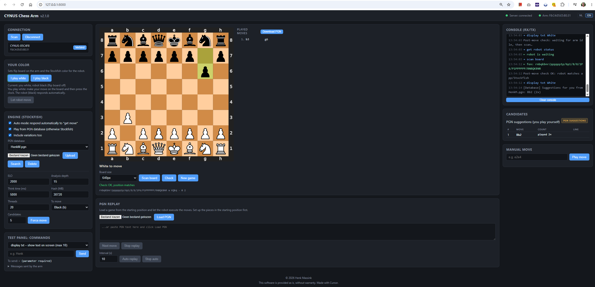

# CYNUS Chess Arm web interface

<p align="center">
  
</p>

Version: see [`VERSION`](VERSION) (currently the single source of truth for the app version).

Local web interface for the CYNUS robotic chess arm. A Python backend talks to
the arm over Bluetooth Low Energy (bleak) and lets Stockfish calculate moves
automatically; the browser shows the board live and provides manual controls
plus a test panel for protocol commands. The UI is bilingual (Dutch / English,
default Dutch).

The **app position** (python-chess / Stockfish) is authoritative: a bad robot
scan does not overwrite the move list or side to move.

## Requirements

- Windows with Bluetooth (BLE), Python 3.10+
- A Stockfish executable (see below)

## Installation

See [`Installation.md`](Installation.md) for the full setup guide, including a
fresh Windows PC with no Python installed (using [uv](https://docs.astral.sh/uv/)),
Stockfish, and `engine_defaults.json`.

Quick start if Python 3.10+ and for example an IDE (Cursor or PyCharm) is already available:

```powershell
python -m venv .venv
.venv\Scripts\pip install -r requirements.txt
.venv\Scripts\python main.py
```

Or use `starten.bat` / `starten.ps1`. Then open http://127.0.0.1:8000 in the browser.

For development auto-reload: `$env:CYNUS_RELOAD=1; .venv\Scripts\python main.py`

Use **NL** / **EN** in the header to switch language.

## Usage

1. Turn on the chess arm and click **Scan**. Devices whose name starts with
   `CYNUS-` or `CMR` appear in the list.
2. Click **Connect**. The status indicator at the top turns green when connected.
3. Choose **I play white** or **I play black** (sets flip board on the arm and
   Stockfish’s color for the robot).
4. Play a move on the physical board. The arm sends the new position
   (`fen: ...`) and requests a move (`get move`); with auto mode on, Stockfish
   (or an optional PGN database) chooses a reply and the arm executes it.
5. In the engine panel you can set ELO, analysis depth, think time, hash,
   threads, side to move, and number of candidate moves. Optionally enable
   **Play from PGN database** to prefer historical moves from a selected `.pgn`
   file before falling back to Stockfish.
6. With **Manual move** you can send a UCI move (e.g. `e2e4`) to the arm.
   Illegal moves are blocked with a warning; you can still force them.
7. **PGN replay** loads a game from the starting position (file or pasted text)
   and lets the robot play the moves one by one; afterwards you can choose a
   color and continue against Stockfish.
8. The **Test panel** has a dropdown with all known protocol commands
   (`move <uci>`, free command, etc.). Everything sent and received appears in
   the console (rx/tx). Use **toon_text** to show text on the arm screen
   (max 10 characters): `Henk` or `Henk,5` clears after that many seconds;
   `Henk,0` leaves the text on screen until something else replaces it.
9. While connected, the app shows who is to move on the arm screen (`Wit` /
   `Zwart` or `White` / `Black`) via `toon_text` → protocol `display txt`.
   That turn label stays on the screen (duration `0`) until the next update.

### Scan mismatch recovery

If a robot scan does not match a legal transition from the app position (a
**gap**), the app keeps its board, move list, and side to move unchanged. A
popup appears and the server rescans in a loop until the scan matches (or a
legal move is recognized). Use **Stop** in the popup to cancel the loop.
When recovery succeeds and it is the robot’s turn (auto mode on), the robot
plays its move.

## Automatic PGN backup (`pgn/`)

Played games are written automatically under [`pgn/`](pgn/) at the project root:

| File | Meaning |
| --- | --- |
| `pgn/current.pgn` | Latest state of the ongoing game (updated after each move) |
| `pgn/YYYY-MM-DD_HHMMSS.pgn` | Archive created when a game with moves is cleared (New game, side change, load another PGN, or return to the starting position) |

Optional opening / history databases live under `pgn/databases/` (configured via
the engine panel). If the on-screen move list disappears, open the matching file
from `pgn/` (or paste its contents) under **PGN replay** to restore the game.
Game backups are local and gitignored (`pgn/*.pgn`).

## Protocol

Derived from `documentation/ble_stockfish2.py` and `documentation/Protocol.txt`:

| Direction  | Message             | Meaning                                    |
| ---------- | ------------------- | ------------------------------------------ |
| arm → host | `fen: <position>`   | Piece placement after each move            |
| arm → host | `get move`          | The arm requests an engine move            |
| host → arm | `move e2e4\r\n`     | The arm physically executes the move       |
| host → arm | `play audio check`  | Play “check” / “checkmate” / “error” audio |
| host → arm | `display txt …`     | Text on the arm screen (max 10 characters) |
| host → arm | `<text>\r\n`        | Free command                               |

Communication uses BLE characteristic `FFF1` (notify + write). New commands for
the test panel are added to the `COMMANDS` array at the top of
`app/static/app.js`.

## Project structure

- `VERSION` – app version number (edit this file to bump the version)
- `Installation.md` – full install guide (uv, Stockfish, engine defaults)
- `engine_defaults.json` – Stockfish start settings for this machine (hash, threads, …)
- `docs/images/` – screenshots and images for documentation
- `pgn/` – automatic PGN backups (`current.pgn` + timestamped archives)
- `pgn/databases/` – optional PGN databases for historical moves
- `app/server.py` – FastAPI server with WebSocket between browser and backend
- `app/version.py` – reads `VERSION`
- `app/ble_manager.py` – BLE scan, connection, and protocol handling
- `app/engine.py` – Stockfish wrapper
- `app/game.py` – game state with python-chess (SVG board + SAN moves)
- `app/historical_moves.py` – historical move lookup from PGN databases
- `app/pgn_databases.py` – PGN database config and upload handling
- `app/pgn_store.py` – writes PGN backups to `pgn/`
- `app/i18n.py` – server-side message translations (NL/EN)
- `app/static/` – web interface (HTML/CSS/JS, no build step; `i18n.js` for UI strings)
- `documentation/` – protocol and examples

## Contact form

The footer **Contact** link opens a modal wired with Formspree’s official [`@formspree/ajax`](https://help.formspree.io/hc/en-us/articles/360013470814-Submit-forms-with-JavaScript-AJAX) SDK (CDN) to form id `xpqvgnkq`. Your inbox address is configured only in the Formspree dashboard (not in this repo). Under the form’s Spam protection settings, enable reCAPTCHA and leave the custom reCAPTCHA key empty so Formspree’s built-in captcha is used.

## Disclaimer

This software is provided as is, without warranty. Made with [Cursor](https://cursor.com).
