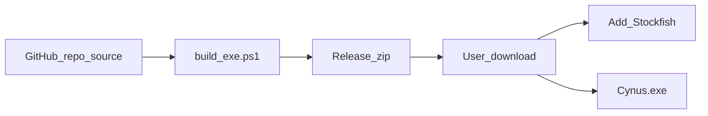

# Plan: Exe-distributie met losse Stockfish-map

Status: **nog niet uitgevoerd** — later oppakken.

Overview: Pak de CYNUS-webinterface als Windows one-folder .exe (PyInstaller) met een losse `stockfish/`-map; broncode blijft in de repo, eindgebruikers downloaden een GitHub Release-zip (geen Python nodig).

## Todos

- [ ] Add `app/paths.py` (frozen vs dev: `bundle_dir`, `app_dir`)
- [ ] Wire `engine.py`, `version.py`, `server.py` to paths + Stockfish folder search
- [ ] Add `cynus.spec`, `requirements-build.txt`, `build_exe.ps1`; gitignore `dist/`/`build/`
- [ ] Build script produces release zip for GitHub Releases
- [ ] Document end-user download (Releases) vs developer build in README

## Bron vs eindgebruiker

**Ja: de exe staat los van de Python-broncode.**

| Wat | Waar |
| --- | --- |
| Python-bron (`app/`, `main.py`, …) | GitHub-repo (voor ontwikkelaars) |
| Build-output (`dist/`, `build/`) | Lokaal / **niet** in git (`.gitignore`) |
| Eindgebruikerspakket | **GitHub Release** (zip-asset), niet de bron-clone |

Eindgebruikers hoeven **geen** Python, venv of broncode te downloaden. Ze nemen het Release-zip van de Releases-pagina.

**Niet alleen `Cynus.exe` + `engine_defaults.json`.** One-folder PyInstaller heeft ook de map `_internal/` nodig (runtime + UI). Zonder die map start de exe niet. Daarom is het gebruikerspakket een **zip**, niet twee losse bestanden.

Wel nodig van de gebruiker zelf (niet in de zip vanwege grootte/licentie): Stockfish in `stockfish/`.

## Aanpak

**PyInstaller one-folder** (niet one-file): sneller starten, stabieler met bleak/BLE, duidelijke mapstructuur.

Release-inhoud (`Cynus-x.y.z-windows.zip`):

```text
Cynus/
  Cynus.exe                  # starter
  _internal/                 # verplicht; mee in de zip (geen Python-installatie)
  stockfish/                 # leeg; gebruiker plaatst stockfish-*.exe hier
  engine_defaults.json       # bewerkbaar; naast de exe
  VERSION
```



## 1. Centrale padhelper

Nieuw bestand `app/paths.py`:

- `is_frozen()` via `getattr(sys, "frozen", False)`
- `bundle_dir()`: meegeleverde resources (`sys._MEIPASS` frozen, anders projectroot)
- `app_dir()`: map naast de exe (frozen) of projectroot (dev) — schrijfbaar
- Gebruik overal i.p.v. `Path(__file__).parent.parent`

## 2. Padgebruik aanpassen

| Bestand | Wijziging |
| --- | --- |
| `app/engine.py` | `engine_defaults.json` uit `app_dir()`; Stockfish: `STOCKFISH_PATH` → `app_dir()/stockfish/` → `app_dir()` → (dev) `app/stockfish/` → PATH |
| `app/version.py` | `VERSION` eerst `app_dir()`, anders `bundle_dir()` |
| `app/server.py` | static uit `bundle_dir()`; frozen: browser openen; `reload` uit |

Stockfish blijft **buiten** de PyInstaller-bundle.

## 3. PyInstaller-build + release-zip

- `requirements-build.txt` met `pyinstaller`
- `cynus.spec`: entry `main.py`, naam `Cynus`; datas voor static/VERSION/defaults; hiddenimports voor uvicorn/bleak/chess
- `build_exe.ps1`: build → lege `stockfish/` → `engine_defaults.json` naast exe → zip `dist/Cynus-VERSION-windows.zip`
- `.gitignore`: `dist/`, `build/`

Handmatige stap na build: zip uploaden naar een **GitHub Release** (tag = `VERSION`). Geen automatische CI in deze scope, tenzij later gewenst.

## 4. Documentatie (`README.md`, Engels)

- **End users**: download Release zip → unzip → put Stockfish in `stockfish/` → run `Cynus.exe` → edit `engine_defaults.json` if needed
- **Developers**: clone repo, venv, `python main.py` of `.\build_exe.ps1`
- Explicit: Python source is not required to run the packaged app; `_internal/` must stay next to the exe

## 5. Acceptatiechecks

- Dev-start blijft werken
- Build produceert map + release-zip
- Zip zonder broncode start op een machine zonder Python
- Zonder Stockfish: UI-warning; met `stockfish/*.exe`: engine OK
- BLE + static UI werken vanuit de exe
